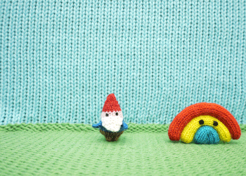

# Welkom
---  

## Een blog over kaboutertjes, wat eten zij zoal ? (test.......... blog)     

       
          

## Nieuws:

 - 17 Nov 2017, Mevrouw E. zegt dat kaboutertjes niet bestaan!  

 
## Lorem ipsum  
[https://nl.wikipedia.org/wiki/Lorem_ipsum](https://nl.wikipedia.org/wiki/Lorem_ipsum)        
       
Lorem ipsum dolor sit amet, consectetuer adipiscing elit. Aenean commodo ligula eget dolor. Aenean massa. Cum sociis natoque penatibus et magnis dis parturient montes, nascetur ridiculus mus. Donec quam felis, ultricies nec, pellentesque eu, pretium quis, sem. Nulla consequat massa quis enim. Donec pede justo, fringilla vel, aliquet nec, vulputate eget, arcu. In enim justo, rhoncus ut, imperdiet a, venenatis vitae, justo. Nullam dictum felis eu pede mollis pretium. Integer tincidunt. Cras dapibus. Vivamus elementum semper nisi. Aenean vulputate eleifend tellus. Aenean leo ligula, porttitor eu, consequat vitae, eleifend ac, enim. Aliquam lorem ante, dapibus in, viverra quis, feugiat a, tellus. Phasellus viverra nulla ut metus varius laoreet. Quisque rutrum. Aenean imperdiet. Etiam ultricies nisi vel augue. Curabitur ullamcorper ultricies nisi. Nam eget dui.    

## Over de Faketekst / Lorem Ipsum
   
### Wat is een Lorem Ipsum?   
Lorem Ipsum (ook wel Faketekst of Dummytekst genoemd) is een proeftekst uit het drukkerij- en zetterijwezen. Tevens webdesigners makken hier vaak gebruik van. Lorem Ipsum is de standaard proeftekst in deze bedrijfstak sinds de 16e eeuw, toen een onbekende drukker een zethaak met letters nam en ze door elkaar husselde om een font-catalogus te maken. Het heeft niet alleen vijf eeuwen overleefd maar is ook, vrijwel onveranderd, overgenomen in elektronische letterzetting. Het is in de jaren '60 populair geworden met de introductie van Letraset vellen met Lorem Ipsum passages en meer recentelijk door desktop publishing software zoals Aldus PageMaker die versies van Lorem Ipsum bevatten.

## Faketekst?    
Zoals benoemd heeft een Faketekst dezelfde functie als een Lorem Ipsum. Een faketekst is echter in ons geval een nederlandse tekst welke wél leesbaar is, doch echter nergens over gaat. Het wordt ook wel een dummytekst genoemd. Een faketekst of dummy tekst is afgeleid van de Lorum Ipsum en door de jaren heen ontstaan. Op sommige proefdrukken etc. heeft het juist wel een meerwaarde om een leesbare tekst te gebruiken. Dit zorgt voor een meer realistisch beeld van tekst op die plek.

## Waarom gebruiken we een Faketekst / Lorem Ipsum?  
Het is al geruime tijd een bekend gegeven dat een lezer, tijdens het bekijken van de layout van een pagina, afgeleid wordt door de tekstuele inhoud. Het belangrijke punt van het gebruik van Lorem Ipsum is dat het uit een min of meer normale verdeling van letters bestaat, in tegenstelling tot "Hier uw tekst, hier uw tekst" wat het tot min of meer leesbaar nederlands maakt. Veel desktop publishing pakketten en web pagina editors gebruiken tegenwoordig Lorem Ipsum als hun standaard model tekst, en een zoekopdracht naar "lorem ipsum" ontsluit veel websites die nog in aanbouw zijn. Verscheidene versies hebben zich ontwikkeld in de loop van de jaren, soms per ongeluk soms expres (ingevoegde humor en dergelijke).

 

 
 
INSPIRATION DAYS

Roses are red.

